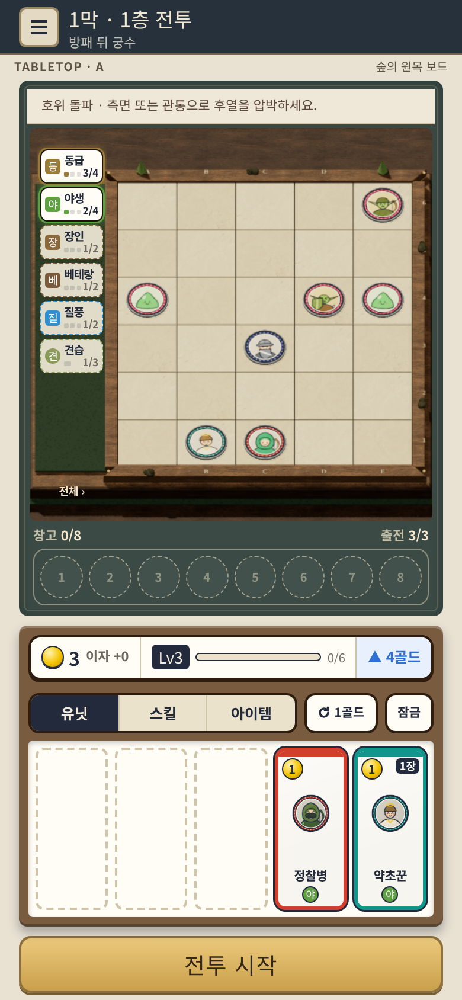
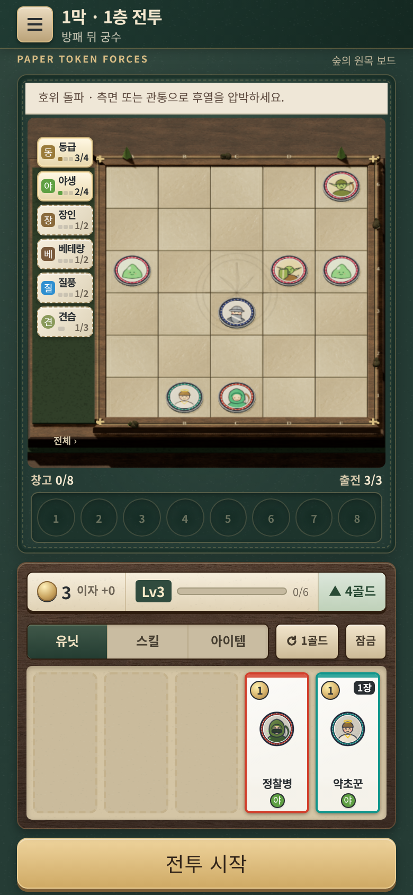
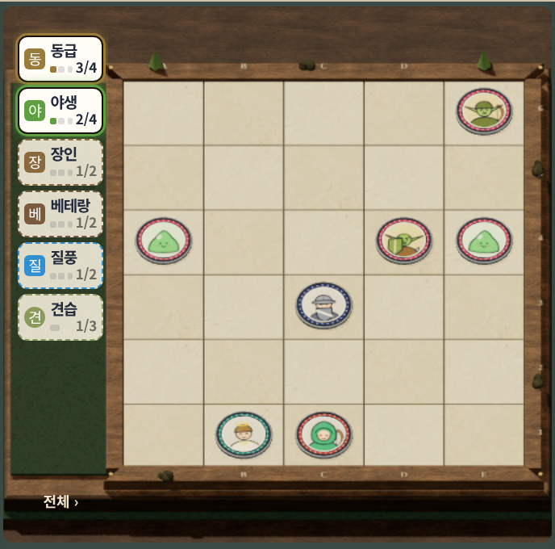
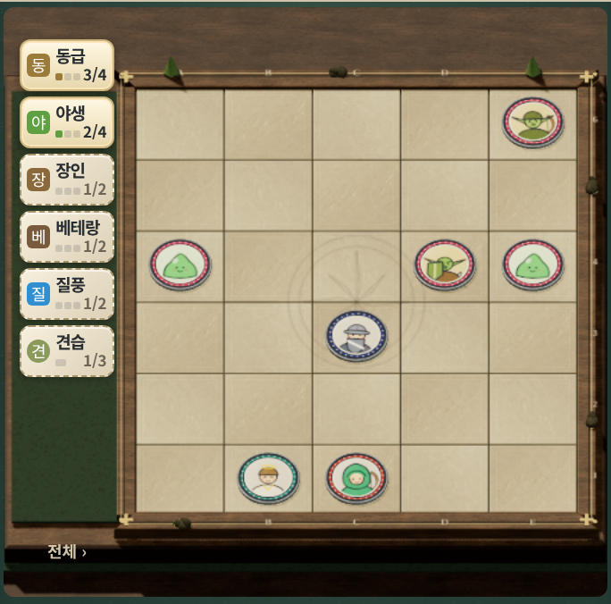
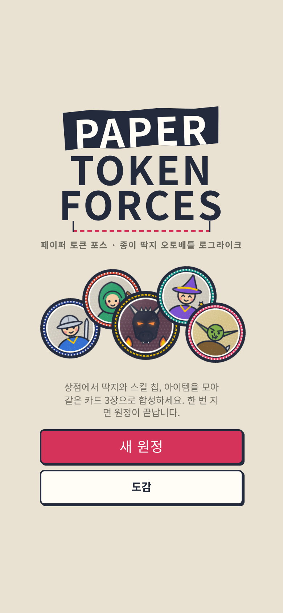
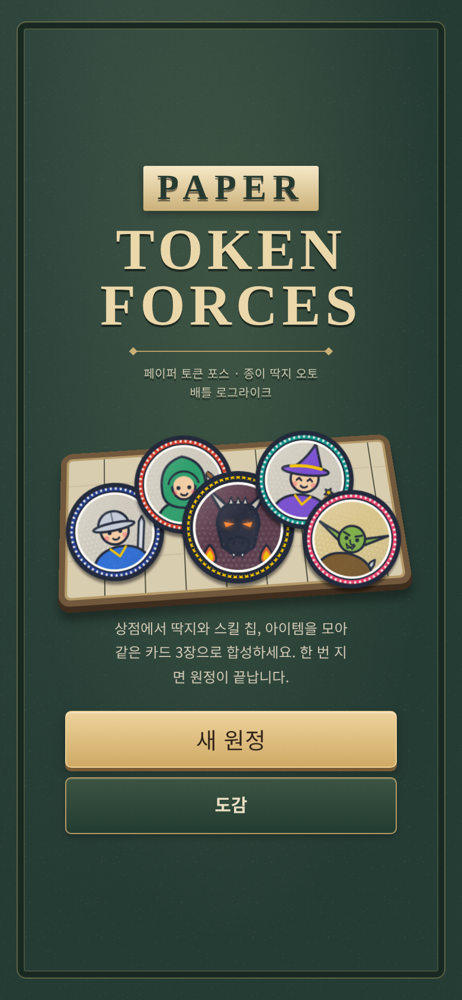

# 보드·배경·UI 품질 개선 · 2026-10-08

별도 `tabletop-a-3d` 브랜치의 동전 딱지 버전에서 보드와 화면 전체의 재질 표현을 발전시켰다. 원본 게임의 규칙·수치·저장·전투 엔진과 동전 애니메이션은 그대로 사용한다.

- [공개 게임 플레이](https://rawcdn.githack.com/Molecova/jules_game/f443dc04efdb46e71f68dd918aa5a3802fe5ed2a/v4/index.html)
- [공개 전후 비교](https://rawcdn.githack.com/Molecova/jules_game/f443dc04efdb46e71f68dd918aa5a3802fe5ed2a/concepts/v4-board-ui-comparison.html)

링크는 구현 커밋 `f443dc0`을 고정해서 사용한다. 첫 호스팅 안내에서 `Open the page`를 누른다.

## 보드

- 호두나무 프레임에 얇은 황동 상감, 어두운 홈, 모서리 금속 장식을 실제 메시로 추가했다.
- 석판마다 전용 UV를 사용해 테두리 음각·모서리 문양·돌의 결이 각 칸에 맞게 보인다.
- 중앙에 낮은 대비의 전장 문양을 새겼다. 동전보다 낮은 평면에 두어 초상화를 덮지 않는다.
- 목재의 색·표면 거칠기, 석판의 색·노멀 세기, 주광·보조광을 조정해 밝은 면과 어두운 옆면이 구분되게 했다.
- 기존 다섯 막의 주변 소품과 재질 변화, 30칸 배치 영역을 유지한다. 새 프레임 장식은 전투 판 밖에 있다.

## 배경과 UI

가죽 테이블·목재 트레이·종이 패널·황동 버튼으로 재질과 색을 통일했다. 화면마다 서로 다른 만화식 두꺼운 테두리를 줄이고, 얇은 테두리와 안쪽 빛·접촉 그림자로 구성품을 구분한다. 질감은 저장소의 고정 SVG 무늬를 사용해 매 프레임 잡음 필터를 계산하지 않는다.

| 화면 | 개선 |
| --- | --- |
| 바탕 | 목재 책상, 깊은 녹색 가죽 질감, 다섯 막의 바탕색 |
| 타이틀 | 금박 느낌의 세리프 로고, 상자 테두리, 딱지 트레이 |
| 전투 | 가죽 매트, 황동 메뉴, 정돈된 시너지 패와 창고 홈 |
| 상점 | 실제 로컬 목재 이미지, 종이 경제 패널, 선택 탭·카드·주 버튼 |
| 지도 | 종이 질감·가장자리 음영·얇은 테두리, 설명 패널 |
| 선택창·상세·도감 | 같은 종이 바탕, 읽기 쉬운 제목, 정돈된 경계·그림자 |

카드 등급·클래스 색, 상점 종류, 가격·출전 수·잠금·합성 표시와 기존 버튼 의미는 유지한다. 폰 화면에서 게임판 공간을 지키기 위해 기존 레이아웃과 카드 높이를 사용한다. 동작 줄이기 설정에서는 합성 강조와 지도 노드의 반복 움직임을 생략한다.

## 실제 화면 비교

[슬라이더로 보는 개선 전후](../concepts/v4-board-ui-comparison.html). `7a219ab`의 변경 전 파일을 브라우저 요청에서 읽어 같은 시드 123과 세 직업의 정상 구매로 촬영했다. 작업 파일을 되돌리거나 별도 체크아웃을 만들지 않았다. 비교 사진은 그림 시안이 아닌 실행 화면이다.

| 이전 | 개선 |
| --- | --- |
|  |  |
|  |  |
|  |  |

## 검사와 비용

기존 Node 테스트 350개와 일반 품질 21딱지 표시·85종 초상화 순환 검사가 통과했다. 21딱지 검사에서 최대 18,902삼각형·70그리기 호출, 초상화 순환을 포함한 추정 텍스처 예산 최대 31.80MiB다. 기존 32MiB 한도를 높이지 않았다.

기존 보드 검사에서 세 화면 크기의 30칸 좌표, 정상 구매·창고↔보드 드래그, 시각 난수 격리, 다섯 막 소품 영역 검사가 통과했다. 1→5막을 20회 반복한 뒤 텍스처 23·지오메트리 25·프로그램 23으로 유지됐다. 실제 전투가 같은 시드의 시뮬레이션과 결과·시간까지 일치하고, 저장한 승패 복원·낮은 품질·명시적 2D·WebGL 실패 복귀도 통과했다. 게임 콘솔 오류 0.

전후 비교 페이지의 일곱 쌍 이미지 로딩, 슬라이더 조작, 두 폰 너비 검사도 통과했다. [보드 검사 요약](board-ui-evidence/after/browser-summary.json), [21딱지 검사 요약](board-ui-evidence/after/normal-stress-summary.json), [비교 페이지 검사](board-ui-evidence/after/comparison-summary.json).

새 UI 검사는 390×844·360×640·768×1024에서 타이틀, 난이도 선택, 지도, 상점 상세·정상 구매, 유닛 상세, 상점 탭·잠금·등급 확률, 키보드 포커스와 저장 후 이어하기 타이틀을 모두 통과했다. 버튼·패널이 화면 안에 있고 가로 넘침이 없으며 콘솔 오류 0이다. [UI 검사 요약](board-ui-evidence/after/ui-summary.json).

공개 URL에서도 세 직업을 정상 구매하고 390×844·360×640에서 실제 전투를 진행했다. 게임의 여섯 PBR 이미지가 로딩되고, 전투 결과·종료 시간이 시뮬레이션과 일치했다. 공개 비교 페이지의 일곱 쌍 이미지와 슬라이더도 통과했다. 게임·비교 페이지 콘솔 오류 0이며, 호스팅 안내의 선택적 외부 광고 차단 오류는 별도로 기록했다. [공개 게임 검사](board-ui-evidence/public/mobile-combat-summary.json), [공개 비교 검사](board-ui-evidence/public/comparison-summary.json).

변경 전 참고 버전의 768px 확대 영역 캡처는 요소 안정성을 기다리다 시간 초과했다. [초기 참고 캡처 로그](board-ui-evidence/before/initial-desktop-capture.log)를 보존했고, 비교 페이지에 필요한 390×844 참고 화면을 대상으로 캡처를 다시 실행했다. 현재 버전의 768×1024 UI·영역 캡처 검사는 통과했다.

중앙 문양은 일반 품질 256×256, 낮은 품질 128×128 캔버스 텍스처 하나다. 테두리 음각은 기존 석판 텍스처에 그리므로 추가 이미지를 받지 않는다. UI의 목재는 이미 포함된 CC0 재질을 재사용하며, 명시적 2D 모드는 목재 이미지와 PBR 다운로드를 생략한다. 추가 모델은 공유 지오메트리와 인스턴스로 그린다.

검증은 클라우드 Chromium의 소프트웨어 WebGL에서 수행했다. 실제 휴대폰에서의 프레임 속도 측정은 포함하지 않는다. 스크린샷·검사에서 선택적 Google Fonts를 시스템 글꼴로 대체했다. 정적 UI 검사와 비교 캡처만 3D 재그리기를 약 3Hz로 제한했고, 별도 보드·전투 검사는 원래 렌더러로 수행한다. 별도 설치·빌드는 필요 없다.

```sh
node --test tests/*.test.cjs
UI_OUTPUT=docs/board-ui-evidence/after node tests/browser-board-ui4.cjs
UI_BASELINE=7a219ab UI_OUTPUT=docs/board-ui-evidence/before node tests/browser-board-ui4.cjs
TABLETOP_OUTPUT=docs/board-ui-evidence/after node tests/browser-tabletop4.cjs
TABLETOP_OUTPUT=docs/board-ui-evidence/after node tests/browser-tabletop-stress4.cjs
TABLETOP_OUTPUT=docs/board-ui-evidence/after node tests/browser-tabletop-mobile4.cjs
node tests/browser-board-comparison4.cjs
```
