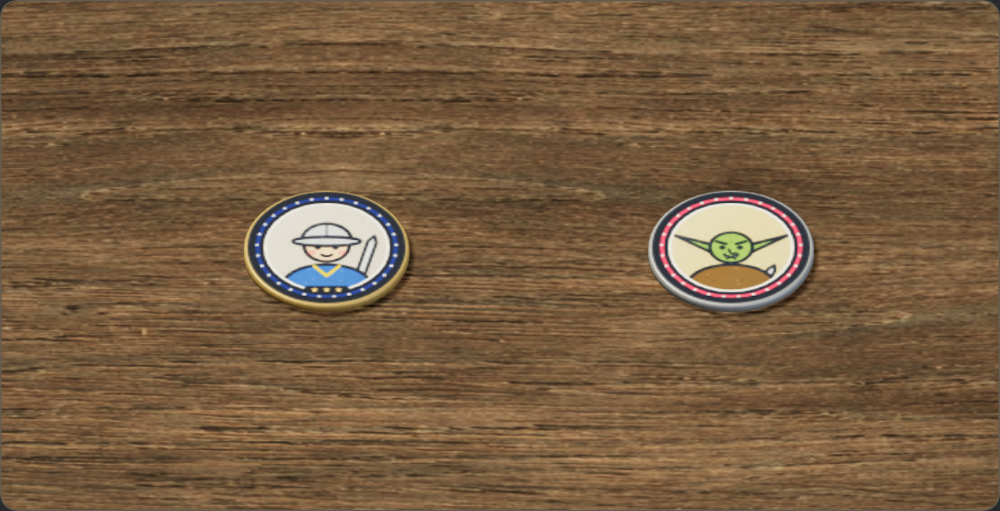

# 동전 딱지와 애니메이션 · 2026-10-08

실제 게임의 유닛 딱지를 얇은 동전 모양으로 바꾸고, 배치부터 전투 퇴장까지 움직임을 연결했다. 기존 게임판·배경, 초상화, 전투 계산을 그대로 사용한다. 원본 작업 브랜치 대신 별도 `tabletop-a-3d` 브랜치에 게시한다.

- [공개 동작 미리보기](https://rawcdn.githack.com/Molecova/jules_game/05777d4b0cced013e154aec39a2c0cca7d438957/concepts/v4-coin-animation.html)
- [공개 게임 플레이](https://rawcdn.githack.com/Molecova/jules_game/05777d4b0cced013e154aec39a2c0cca7d438957/v4/index.html)

처음 표시되는 호스팅 안내에서 `Open the page`를 누른다. 링크는 구현 커밋 `05777d4`의 고정된 파일을 사용한다.

## 모양

일반 딱지는 논리 지름 46px, 두께 2.88px다. 이전 6.72px보다 약 57% 얇으며, 실제 상하 뚜껑이 있는 원기둥과 작은 모따기, 금속 옆면의 잔무늬를 갖는다. 고무처럼 늘어나거나 찌그러지지 않는다. 몸체와 인쇄 면 두 메시만 사용한다. 2·3성은 은색·금색 옆면과 면에 인쇄한 별로 구분하고, 솟아 있는 성급 핀은 제거했다.



## 움직임

| 상황 | 동작 |
| --- | --- |
| 배치 | 0.26초 동안 내려와 안착 |
| 준비 단계 위치 변경 | 0.22초 동안 살짝 들려 이동; 실제 칸 변경은 즉시 적용 |
| 전투 이동 | 실제 이동 진행률에 맞춰 들림·기울기 |
| 선택 | 살짝 들고 기울여 표시 |
| 전사 근접 공격 | 0.28초 동안 공격 방향으로 기울고 전진 |
| 궁수 원거리 공격 | 0.28초 동안 뒤로 반동 |
| 마법사 공격 | 0.28초 동안 들림·회전·반동 |
| 스킬 시전 | 실제 `castCount` 증가 때 0.42초 들림·회전 |
| 피격 | 0.22초 반동·흔들림과 기존 피격 빛 |
| 사망 | 0.56초 기울어 구르며 사라짐; 종이 찢김 제거 |

기울어진 동전의 높이를 조정해 판에 파묻히지 않도록 했다. 전투 배속을 따르고, 시트·도감·백그라운드로 전투가 멈추면 동전도 멈춘다. 기기의 동작 줄이기 설정에서는 장식 움직임·피격 섬광을 생략하고 사망 딱지를 즉시 정리한다.

게임과 [조작 가능한 확대 미리보기](../concepts/v4-coin-animation.html)가 같은 `v4/tabletop-tokens4.js` 모델을 사용한다. 미리보기는 자동 순환하며 직업·성급·동작을 버튼으로 고를 수 있다. 이는 전투 수치 시뮬레이션이 아닌 동작 시연이다. [브라우저에서 실제 녹화한 영상](coin-evidence/coin-animations.webm)도 저장했다.

## 게임 연결

`game4.js`의 기존 전투 훅을 먼저 실행한 뒤 렌더러에 공격·피격·사망을 알린다. 기존 훅 반환값을 보존한다. 시뮬레이션과 건너뛰기에서는 동작 이벤트를 보내지 않는다. 유닛 고유 ID로 메시를 유지하므로 동일 초상화의 여러 딱지 중 하나가 죽어도 다른 딱지가 바뀌지 않는다. 사망 훅 실행 후 생존 상태를 다시 확인해 수호 등불의 즉시 부활을 시체로 그리지 않는다.

공용 엔진·전투 수치·데이터·경제·합성·저장 파일은 수정하지 않았다. 시각 애니메이션은 전투 개체나 난수 상태를 변경하지 않는다. 명시적 2D 선택과 WebGL 실패 시 기존 렌더러로 복귀하는 동작도 검사했다.

## 검증

- 기존 Node 테스트 **350/350 통과**.
- 새 동전 검사: 두께·메시 수·성급·세 직업 공격·이동·시전·피격·사망, 일시 정지, 동작 줄이기, 동일 유닛 ID, 실제 사망 훅, 즉시 부활, 시각 난수 격리 통과. 콘솔 오류 0.
- 기존 3D 검사: 360×640·390×844·768×1024에서 30칸 입력·드래그, 다섯 막 테마, 2D 선택·WebGL 실패 복귀 통과. 실제 전투 결과가 같은 시드의 시뮬레이션과 일치.
- 별도 모바일 검사에서 상점 버튼으로 세 직업을 정상 구매한 뒤 실제 전투 진행. 390×844·360×640에서 가로 넘침 없음, 전투 결과·시간 일치, 게임 콘솔 오류 0.
- 1→5막을 20회 순환한 뒤 GPU 리소스 수가 텍스처 22·지오메트리 23·프로그램 20으로 유지됐다.
- 일반 품질 21딱지 표시 시 최대 18,708삼각형·66그리기 호출. 85종 적 초상화 순환 검사에서 초상화 캐시 1.5MiB 이하, 추정 텍스처 예산 32MiB 이하. 동전 옆면 텍스처는 약 0.042MiB다.

21딱지 및 사망·부활 검사는 제어된 표시/엔진 회귀 검사이며 정상 원정 승리 기록으로 계산하지 않았다. 검증 환경은 클라우드 Chromium의 소프트웨어 WebGL이므로 실제 휴대폰 FPS 측정은 아니다. 모바일 게임 검사에서 선택적 Google Fonts CSS는 시스템 글꼴로 대체했다.

증거: [동전 검사 요약](coin-evidence/coin-summary.json), [기존 3D 검사 요약](coin-evidence/browser-summary.json), [21딱지·캐시 검사 요약](coin-evidence/normal-stress-summary.json), [모바일 실제 전투 요약](coin-evidence/mobile-combat-summary.json).

공개 링크도 Chromium에서 별도로 열어 확인했다. 미리보기의 공유 모델 로딩·세 직업 공격 자세·두 폰 너비 검사와 게임의 정상 구매·실제 전투·결과 일치 검사가 통과했다. 게임과 미리보기 콘솔 오류는 0이다. 호스팅 안내에 붙는 선택적 외부 광고의 차단 오류 1건씩은 게임 오류와 구분해 원문을 기록했다. [공개 미리보기 검사](coin-evidence/public/preview-public-summary.json), [공개 게임 검사](coin-evidence/public/mobile-combat-summary.json).

## 재현

정적 서버를 8001에서 실행하고 Node.js·Playwright·Chromium으로 검사한다. 동영상 녹화 검사에만 Playwright ffmpeg가 필요하며, 게임 실행에는 별도 설치나 빌드가 필요 없다.

```sh
node --test tests/*.test.cjs
TABLETOP_OUTPUT=docs/coin-evidence node tests/browser-tabletop4.cjs
TABLETOP_OUTPUT=docs/coin-evidence node tests/browser-tabletop-stress4.cjs
TABLETOP_OUTPUT=docs/coin-evidence node tests/browser-tabletop-mobile4.cjs
PLAYWRIGHT_BROWSERS_PATH=/workspace/.cache/coin-playwright node tests/browser-coin-animation4.cjs
node tests/browser-coin-public4.cjs
```

클라우드 설정 초안의 설치 스크립트에 공식 Playwright ffmpeg 다운로드를 추가하고, 시작 지침에 별도 3D 경로·8001 서버·녹화용 캐시 경로를 저장했다. 기존 원본 작업 경로와 브랜치는 유지한다.
